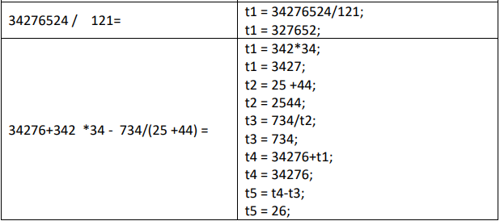

# Arithmetic Expression Compiler using Flex & Bison

It was tasked to convert arithmetic expression to Three Address Code (TAC) so that 
- b+a: digits of number b that are not in number a are added to the end of a.
- b-a: digits of number b that are in number a are removed from a.
- b*a: the digit resulting from the sum of the digits (or the sum of the digits) of 
the number b is added to the end of a if it does not exist in a.
- b/a: the digit obtained from the sum of the digits (or the sum of the digits) of 
the number b, if it exists in a, is removed from a.

We created Lexical phase with Flex and Syntax Analysis and TAC with bison.
Arithmetic priority also included.




## How to Use

```
gcc  -o Proj2 Lexical.lex.c SyntaxInter.tab.c VarClass.c -lm
```


## Note
1- this program doesn't have GUI and you should work with Command Promt.

2- libraries used: just C standard libraries.

License
=======

    Copyright 2023 Mohammad Sadra Sarparandeh
    Licensed under the Apache License, Version 2.0 (the "License");
    you may not use this file except in compliance with the License.
    You may obtain a copy of the License at

       http://www.apache.org/licenses/LICENSE-2.0

    Unless required by applicable law or agreed to in writing, software
    distributed under the License is distributed on an "AS IS" BASIS,
    WITHOUT WARRANTIES OR CONDITIONS OF ANY KIND, either express or implied.
    See the License for the specific language governing permissions and
    limitations under the License.